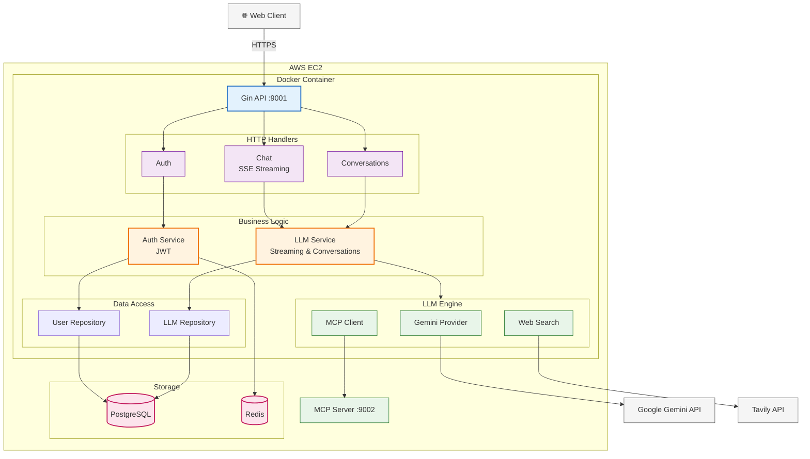

```mermaid
graph TB
    Client["🌐 Web Client"]

    subgraph AWS["AWS EC2"]
        subgraph App["Docker Container"]
            API["Gin API :9001"]

            subgraph Handlers["HTTP Handlers"]
                Auth["Auth"]
                Chat["Chat<br/>SSE Streaming"]
                Conv["Conversations"]
            end

            subgraph Services["Business Logic"]
                AuthSvc["Auth Service<br/>JWT"]
                LLMSvc["LLM Service<br/>Streaming & Conversations"]
            end

            subgraph Engine["LLM Engine"]
                Provider["Gemini Provider"]
                MCPClient["MCP Client"]
                Search["Web Search"]
            end

            subgraph Repositories["Data Access"]
                UserRepo["User Repository"]
                LLMRepo["LLM Repository"]
            end
        end

        MCP["MCP Server :9002"]

        subgraph Storage["Storage"]
            DB[("PostgreSQL")]
            Redis[("Redis")]
        end
    end

    Gemini["Google Gemini API"]
    Tavily["Tavily API"]

    %% Request flow
    Client -->|HTTPS| API
    API --> Auth
    API --> Chat
    API --> Conv

    Auth --> AuthSvc
    Chat --> LLMSvc
    Conv --> LLMSvc

    %% Business logic
    AuthSvc --> UserRepo
    AuthSvc --> Redis

    LLMSvc --> Engine
    LLMSvc --> LLMRepo

    %% Engine
    Provider --> Gemini
    MCPClient --> MCP
    Search --> Tavily

    %% Data
    UserRepo --> DB
    LLMRepo --> DB

    %% Styling
    classDef api fill:#e3f2fd,stroke:#1565c0,stroke-width:2px
    classDef handler fill:#f3e5f5,stroke:#7b1fa2,stroke-width:1px
    classDef service fill:#fff3e0,stroke:#ef6c00,stroke-width:2px
    classDef engine fill:#e8f5e9,stroke:#2e7d32,stroke-width:1px
    classDef storage fill:#fce4ec,stroke:#c2185b,stroke-width:2px
    classDef external fill:#f5f5f5,stroke:#616161,stroke-width:1px

    class API api
    class Auth,Chat,Conv handler
    class AuthSvc,LLMSvc service
    class Provider,MCPClient,Search,MCP engine
    class DB,Redis storage
    class Client,Gemini,Tavily external
```